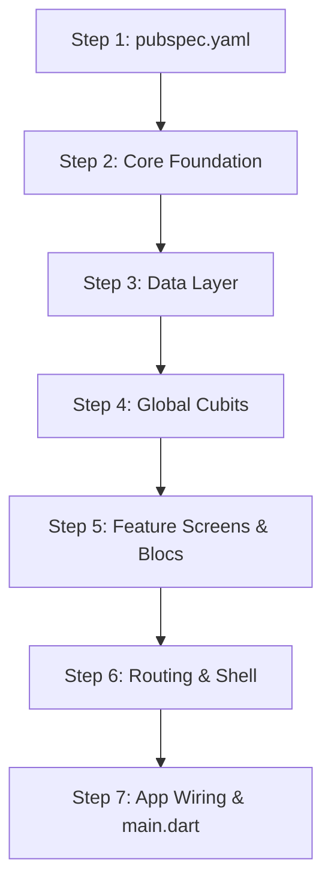

# Codemap

This guide is a step-by-step roadmap for rebuilding this entire project from scratch. It documents the purpose of every file, the logical construction sequence (so you never run into missing imports or circular dependencies), and the core patterns used throughout.

---

## 1. Architecture Overview

The project uses a **Feature-Driven Architecture** with clean layer separation:

```
lib/
├── core/         # Cross-cutting foundational modules (Config, API, Storage, Theme, Widgets)
├── data/         # Data contracts (Models) and data source abstractions (Repositories)
├── features/     # Encapsulated domains (Auth, Posts, Users, Favorites, Settings, History, Home)
├── router/       # GoRouter routing, Shell routes, and route guards
└── main.dart     # Bootstrap & entry point
```

### Key Libraries
- **`flutter_bloc`**: State management (`Bloc` for event-driven logic, `Cubit` for state-driven flows).
- **`go_router`**: Declarative routing, nested shell navigation, and reactive auth guards.
- **`dio`**: Network client with interceptors and error normalization.
- **`shared_preferences`**: Local offline key-value storage.
- **`equatable`**: Value equality comparison for states and events.

---

## 2. Rebuild Sequence (Step-by-Step)

Follow this chronological build order to avoid unresolved references as you write code.



---

### Step 1: Dependencies (`pubspec.yaml`)

Add the required production and development dependencies:

```yaml
dependencies:
  flutter:
    sdk: flutter
  flutter_bloc: ^9.1.1
  go_router: ^14.8.1
  dio: ^5.8.0+1
  equatable: ^2.0.7
  shared_preferences: ^2.5.2

dev_dependencies:
  flutter_test:
    sdk: flutter
  flutter_lints: ^6.0.0
  bloc_test: ^10.0.0
  mocktail: ^1.0.4
```

---

### Step 2: Core Foundation (`lib/core/`)

Core files have zero dependencies on features or data, making them the starting building blocks.

#### 1. Configuration & Storage
- `lib/core/config/app_config.dart`
  - Defines app environment (`dev`, `staging`, `prod`) and base API URL (`jsonplaceholder.typicode.com`).
- `lib/core/storage/local_storage_service.dart`
  - Wraps `SharedPreferences`. Handles token caching, user sessions, theme preferences, favorites IDs, and history lists.

#### 2. Network Client (`lib/core/api/`)
- `lib/core/api/api_endpoints.dart`: Static constants for URL paths (`/posts`, `/users`, `/comments`).
- `lib/core/api/api_exception.dart`: Custom typed exception class mapping HTTP status codes (401, 404, 500, network timeout) into user-friendly messages.
- `lib/core/api/api_interceptors.dart`: Dio interceptor that injects Bearer auth tokens and logs requests/responses.
- `lib/core/api/api_client.dart`: Configures Dio instance with timeouts, interceptors, and typed HTTP helpers (`get`, `post`, `put`, `delete`).

#### 3. Styling & Theme (`lib/core/theme/`)
- `lib/core/theme/app_colors.dart`: Central color palette (brand primaries, dark mode surfaces, badges).
- `lib/core/theme/app_theme.dart`: Factory methods returning `ThemeData` for both Light and Dark themes with custom input/card/appbar themes.

#### 4. Utilities & Observer (`lib/core/utils/`)
- `lib/core/utils/debouncer.dart`: Lightweight timer utility for search inputs.
- `lib/core/utils/app_feedback.dart`: SnackBar and visual toast feedback helpers.
- `lib/core/utils/app_bloc_observer.dart`: Overrides `BlocObserver` (`onChange`, `onError`, `onTransition`) to print diagnostic logs in debug mode.

#### 5. Reusable UI Widgets (`lib/core/widgets/`)
- `lib/core/widgets/app_loading_indicator.dart`: Standardized centered loading spinner.
- `lib/core/widgets/app_empty_state.dart`: Empty view with icon, title, message, and optional action button.
- `lib/core/widgets/app_error_state.dart`: Error state card with retry callback button.
- `lib/core/widgets/app_shimmer_skeleton.dart`: Skeleton shimmer placeholder cards for lists and detail screens.
- `lib/core/widgets/app_dialogs.dart`: Confirmation and alert dialog helpers.

---

### Step 3: Data Layer (`lib/data/`)

#### 1. Models (`lib/data/models/`)
Implement models with `fromJson`, `toJson`, and `Equatable`:
- `lib/data/models/user.dart`: User profile, address, company, email, phone.
- `lib/data/models/post.dart`: Post entity (`id`, `userId`, `title`, `body`).
- `lib/data/models/comment.dart`: Comment entity (`id`, `postId`, `name`, `email`, `body`).

#### 2. Repositories (`lib/data/repositories/`)
Bridge between API / Storage and BLoCs:
- `lib/data/repositories/user_repository.dart`: Fetches all users and user details via `ApiClient`.
- `lib/data/repositories/post_repository.dart`: Fetches paginated/all posts, single post details, comments, and creates new posts.
- `lib/data/repositories/favorites_repository.dart`: Persists and toggles favorite post IDs in `LocalStorageService`.
- `lib/data/repositories/history_repository.dart`: Records recently viewed post/user IDs in `LocalStorageService`.

---

### Step 4: Global & Cross-Cutting State (`lib/features/`)

These manage state that persists across multiple routes and must be provided near the root.

- `lib/features/auth/cubit/auth_cubit.dart`
  - State: `AuthStatus` (`authenticated`, `unauthenticated`, `authenticating`), user token, email.
  - Controls login, logout, and token restoration on launch.
- `lib/features/settings/cubit/settings_cubit.dart`
  - State: `ThemeMode` (`system`, `light`, `dark`), push notification flags.
- `lib/features/favorites/cubit/favorites_cubit.dart`
  - State: List of favorite post IDs and loaded favorite `Post` objects.
- `lib/features/history/cubit/history_cubit.dart`
  - State: Recently viewed post records with timestamps.

---

### Step 5: Feature Screens & Specific Blocs

Now build individual feature UIs and their dedicated Cubits/Blocs.

#### 1. Settings & Authentication
- `lib/features/settings/views/login_screen.dart`
  - Login form with email/password validation calling `AuthCubit.login()`.
- `lib/features/settings/views/settings_screen.dart`
  - Theme mode switch, cache clear, account info, and logout button.

#### 2. Home Dashboard
- `lib/features/home/views/home_screen.dart`
  - Quick statistics, recent activity feed, navigation shortcuts to Posts and Users.

#### 3. Users Feature
- `lib/features/users/cubit/users_cubit.dart`: Loads list of users with search filter.
- `lib/features/users/cubit/user_details_cubit.dart`: Loads single user, user company, and user posts.
- `lib/features/users/views/users_screen.dart`: Searchable user list with avatar cards.
- `lib/features/users/views/user_details_screen.dart`: Profile header, user contact info, and authored posts list.

#### 4. Posts Feature
- `lib/features/posts/bloc/posts_event.dart`: `PostsFetchStarted`, `PostsRefreshed`, `PostsSearchChanged`, `PostsFilterByUser`.
- `lib/features/posts/bloc/posts_state.dart`: Status enum, posts list, filtered list, search query, selected user filter.
- `lib/features/posts/bloc/posts_bloc.dart`: Handles event-driven post filtering, pull-to-refresh, and search debouncing.
- `lib/features/posts/cubit/post_details_cubit.dart`: Fetches post body, author info, and comments list.
- `lib/features/posts/cubit/create_post_cubit.dart`: Form validation and submit state for creating a post.
- `lib/features/posts/views/posts_screen.dart`: Feed of posts with search bar, user filter chips, and floating action button.
- `lib/features/posts/views/post_details_screen.dart`: Full post view with author badge, comments section, and favorite toggle.
- `lib/features/posts/views/create_post_screen.dart`: Protected form screen for submitting a new post.

#### 5. Favorites Feature
- `lib/features/favorites/views/favorites_screen.dart`: Displays saved favorite posts with quick-remove option.

---

### Step 6: Navigation Layer (`lib/router/`)

- `lib/router/route_names.dart`
  - Defines URL paths (`/`, `/users`, `/posts`, `/settings`, `/login`, `/favorites`, `/posts/create`, `/posts/:id`, `/users/:id`) and matching route name constants.
- `lib/router/app_router.dart`
  - **`GoRouterRefreshStream`**: Subscribes to `authCubit.stream` so route redirects re-evaluate on login/logout.
  - **`redirect` guard**: Intercepts unauthenticated users trying to access protected routes (`/posts/create`) and sends them to `/login?from=...`.
  - **`StatefulShellRoute.indexedStack`**: Hosts bottom navigation tabs (Home, Users, Posts, Settings) while keeping state and scroll position intact.
  - **Root Navigator routes**: Full-screen pages outside the bottom shell (`/login`, `/favorites`, `/posts/create`, details pages).

---

### Step 7: App Assembly & Entry Point

- `lib/features/app/app.dart`
  - Instantiates `LocalStorageService`, `ApiClient`, and Repositories in `initState`.
  - Wraps tree in `MultiRepositoryProvider` and `MultiBlocProvider`.
  - Configures `MaterialApp.router` with themes from `AppTheme` and router from `AppRouter`.
- `lib/main.dart`
  - Runs `WidgetsFlutterBinding.ensureInitialized()`.
  - Assigns `Bloc.observer = AppBlocObserver()`.
  - Calls `await LocalStorageService.init()`.
  - Calls `runApp(App(...))`.

---

## 3. Complete File Map

| Path | Primary Responsibility | Key Dependencies |
|---|---|---|
| `lib/main.dart` | Application bootstrap & initializers | `App`, `LocalStorageService`, `AppBlocObserver` |
| `lib/core/config/app_config.dart` | Environment constants & API base URL | None |
| `lib/core/storage/local_storage_service.dart` | SharedPreferences storage wrapper | `shared_preferences` |
| `lib/core/api/api_endpoints.dart` | REST API URL paths | None |
| `lib/core/api/api_exception.dart` | Error classification & message parser | `dio` |
| `lib/core/api/api_interceptors.dart` | Token injection & network logging | `dio` |
| `lib/core/api/api_client.dart` | Configured Dio client wrapper | `dio`, `app_config.dart`, `api_exception.dart` |
| `lib/core/theme/app_colors.dart` | Color palette constants | `flutter/material.dart` |
| `lib/core/theme/app_theme.dart` | Light & Dark ThemeData builders | `app_colors.dart` |
| `lib/core/utils/debouncer.dart` | Search input debounce timer | `dart:async` |
| `lib/core/utils/app_feedback.dart` | SnackBar & banner alerts | `flutter/material.dart` |
| `lib/core/utils/app_bloc_observer.dart` | Global BLoC state logger | `flutter_bloc` |
| `lib/core/widgets/app_loading_indicator.dart` | Reusable loading spinner | `flutter/material.dart` |
| `lib/core/widgets/app_empty_state.dart` | Reusable empty list placeholder | `flutter/material.dart` |
| `lib/core/widgets/app_error_state.dart` | Reusable retry error view | `flutter/material.dart` |
| `lib/core/widgets/app_shimmer_skeleton.dart` | Skeleton loading placeholder cards | `flutter/material.dart` |
| `lib/core/widgets/app_dialogs.dart` | Confirmation dialog popups | `flutter/material.dart` |
| `lib/data/models/user.dart` | User JSON data model | `equatable` |
| `lib/data/models/post.dart` | Post JSON data model | `equatable` |
| `lib/data/models/comment.dart` | Comment JSON data model | `equatable` |
| `lib/data/repositories/user_repository.dart` | User data fetching abstraction | `api_client.dart`, `user.dart`, `post.dart` |
| `lib/data/repositories/post_repository.dart` | Posts and comments fetching | `api_client.dart`, `post.dart`, `comment.dart` |
| `lib/data/repositories/favorites_repository.dart` | Bookmarked posts persistence | `local_storage_service.dart` |
| `lib/data/repositories/history_repository.dart` | Browsing history persistence | `local_storage_service.dart` |
| `lib/features/auth/cubit/auth_cubit.dart` | Authentication state & token manager | `local_storage_service.dart`, `equatable` |
| `lib/features/settings/cubit/settings_cubit.dart` | ThemeMode & app settings state | `local_storage_service.dart`, `equatable` |
| `lib/features/favorites/cubit/favorites_cubit.dart` | Favorite posts list state | `favorites_repository.dart`, `post_repository.dart` |
| `lib/features/history/cubit/history_cubit.dart` | Viewing history state | `history_repository.dart`, `post_repository.dart` |
| `lib/features/home/views/home_screen.dart` | Main dashboard tab | `go_router`, `favorites_cubit.dart`, `history_cubit.dart` |
| `lib/features/users/cubit/users_cubit.dart` | Users directory list state | `user_repository.dart`, `equatable` |
| `lib/features/users/cubit/user_details_cubit.dart` | Single user details & posts state | `user_repository.dart`, `equatable` |
| `lib/features/users/views/users_screen.dart` | Users tab list screen | `users_cubit.dart`, `go_router` |
| `lib/features/users/views/user_details_screen.dart` | User profile detail screen | `user_details_cubit.dart`, `go_router` |
| `lib/features/posts/bloc/posts_event.dart` | Events for posts feed | `equatable` |
| `lib/features/posts/bloc/posts_state.dart` | States for posts feed | `post.dart`, `equatable` |
| `lib/features/posts/bloc/posts_bloc.dart` | Posts filtering & search logic | `post_repository.dart`, `posts_event.dart`, `posts_state.dart` |
| `lib/features/posts/cubit/post_details_cubit.dart` | Post details & comments state | `post_repository.dart`, `equatable` |
| `lib/features/posts/cubit/create_post_cubit.dart` | Create post submission state | `post_repository.dart`, `equatable` |
| `lib/features/posts/views/posts_screen.dart` | Posts tab screen with search/filter | `posts_bloc.dart`, `go_router` |
| `lib/features/posts/views/post_details_screen.dart` | Full post view with comments | `post_details_cubit.dart`, `favorites_cubit.dart` |
| `lib/features/posts/views/create_post_screen.dart` | Create post form view | `create_post_cubit.dart`, `go_router` |
| `lib/features/favorites/views/favorites_screen.dart` | Saved favorites list screen | `favorites_cubit.dart`, `go_router` |
| `lib/features/settings/views/login_screen.dart` | Authentication login screen | `auth_cubit.dart`, `go_router` |
| `lib/features/settings/views/settings_screen.dart` | Settings tab screen | `settings_cubit.dart`, `auth_cubit.dart` |
| `lib/router/route_names.dart` | Centralized route constants | None |
| `lib/router/app_router.dart` | GoRouter setup, Shell, and Guards | `go_router`, `auth_cubit.dart`, `route_names.dart` |
| `lib/features/app/app.dart` | Root MultiProvider & MaterialApp | All Repositories, Cubits, and `app_router.dart` |
